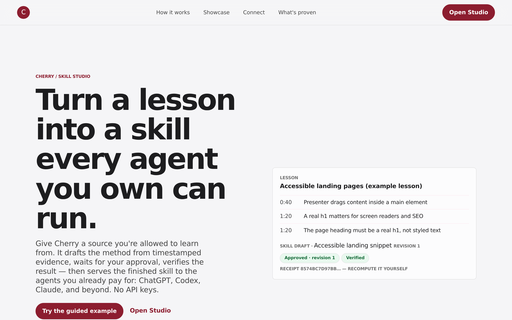

<p align="center">
  
</p>

# Cherry 🍒

**Teach once. Cherry remembers. Every agent gets better.**

You learn your craft from creators: a YouTube lesson, an article, a post. Your agents cannot. Every
workflow you teach an AI dies in a chat transcript, unusable in the next session and the next tool.

Cherry is the layer underneath. Give it a source you are allowed to learn from. It drafts the method
from timestamped evidence, waits for your approval on an exact revision, verifies the result with
checks that can genuinely fail, seals it with a receipt anyone can recompute, and then serves the
finished skill to the agents you already pay for.

**Cherry never calls a model and never asks for an API key.** Your agents bring the reasoning.
Cherry brings the memory, the approval gates, and the proof.

- **Live:** https://cherry-wine.vercel.app
- **Judge route:** https://cherry-wine.vercel.app/showcase
- **Watch a real run:** the uncut recording of the automated end-to-end test driving the product,
  linked from the showcase page. Nothing staged.
- **What is actually proven:** https://cherry-wine.vercel.app/compatibility

Built for the **OpenAI WebMCP Challenge 2026**. MIT licensed. Free and open source, with no paid
tier, no account required, and no telemetry.

## The inversion

Most agent-ready sites let an agent operate them. **Cherry's site upgrades the agent.**

Three always-on WebMCP read tools serve your library to any agent that visits:

| Tool | What it does |
| --- | --- |
| `list_skills` | Every skill you have taught, with status, revision, and approval hash |
| `recommend_skills` | "Here is my task" → ranked approved skills, with an explanation of each match |
| `get_skill` | Install-ready SKILL.md / AGENTS.md / CLAUDE.md, streamed in bounded parts with a full-file SHA-256 the agent verifies |

Only human-approved exact revisions are installable. An agent can request an approval; it can never
grant one. Everything else stays state-gated behind a bounded aperture: at most five contextual
mutation tools per surface, registered and unregistered live as the work advances.

## How it works

1. **Add a source.** A YouTube lesson (official embed, your transcript or on-device Whisper), an
   article, plain text, a file, your own watch-history export, or any page via the Save to Cherry
   bookmarklet.
2. **Approve the method.** Cherry compiles evidence into a readable, versioned skill. You approve
   the exact revision you read. Edit one step and the approval goes stale.
3. **Use it everywhere.** Install into Codex (`AGENTS.md`), Claude Code (`SKILL.md`), or any agent
   reading Agent Skills bundles. Or let a visiting agent pull it live over WebMCP.

## Quickstart

```bash
npm ci
npm run dev        # http://127.0.0.1:5273
```

Everything works as a guest with zero configuration. Sign-in (Privy, email) is opt-in and only
activates when `VITE_PRIVY_APP_ID` is set at build time; guests never download the auth SDK.

```bash
npm run gates      # typecheck + lint + unit + runner
npm run verify:all # gates + build + e2e + pack verification + submission audit
```

## Verification

Cherry's claims are meant to survive checking. Current gates on `main`:

| Gate | Result |
| --- | --- |
| Unit | 379 passed, 2 opt-in skips |
| Runner and MCP bridge | 68 passed |
| End-to-end (Playwright, desktop + mobile) | 84 passed |
| Bundle verification (`verify:pack`) | tamper-evident, evidence-complete |
| Submission audit | 0 failures, 0 warnings |

Proof receipts are SHA-256 over RFC 8785 canonical JSON. Change one byte and verification fails.
Every compiled bundle ships its own standalone `scripts/verify.mjs` so a stranger can check it
without trusting us.

## Deliberate boundaries

These are product decisions, not missing features:

- Cherry does **not** watch video. It works from transcripts you supply, on-device Whisper, or
  captions you paste. No frame-level vision is claimed anywhere.
- Cherry does **not** scrape LinkedIn, download YouTube media, or automate anyone's ChatGPT
  account. Agents connect through WebMCP, MCP, and skills bundles.
- Nothing fetches in the background. Every fetch is user-triggered or scheduled by you to your own
  paired local runner, and fails closed.
- Approvals, trust promotion, and memory activation are human-only code paths.

## Contributing

Read [docs/HARNESS.md](docs/HARNESS.md) first for how the product engine and the build harness
actually work. Then see [CONTRIBUTING.md](CONTRIBUTING.md) for the gates, the file lanes, the claim
discipline, and four worked extension points: adding a source kind, adding a WebMCP tool, adding an export target, and
adding a runner job type. Good starting points are in
[docs/GOOD_FIRST_ISSUES.md](docs/GOOD_FIRST_ISSUES.md).

## License

MIT. See [LICENSE](LICENSE).
